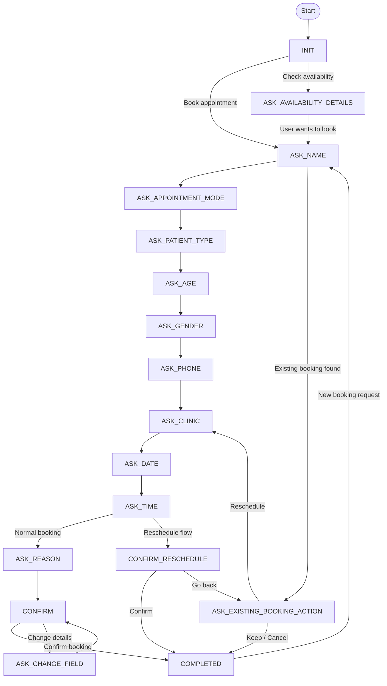

# Appointment Conversation Flow

```mermaid
flowchart TD
    Start([Start]) --> Init[INIT]

    Init -->|Book appointment| Name[ASK_NAME]
    Init -->|Check availability| Avail[ASK_AVAILABILITY_DETAILS]
    Avail -->|User wants to book| Name

    Name --> Mode[ASK_APPOINTMENT_MODE]
    Name -->|Existing booking found| Existing[ASK_EXISTING_BOOKING_ACTION]

    Existing -->|Keep / Cancel| Done[COMPLETED]
    Existing -->|Reschedule| Clinic[ASK_CLINIC]

    Mode --> Type[ASK_PATIENT_TYPE]
    Type --> Age[ASK_AGE]
    Age --> Gender[ASK_GENDER]
    Gender --> Phone[ASK_PHONE]
    Phone --> Clinic[ASK_CLINIC]
    Clinic --> Date[ASK_DATE]
    Date --> Time[ASK_TIME]

    Time -->|Normal booking| Reason[ASK_REASON]
    Time -->|Reschedule flow| Reconfirm[CONFIRM_RESCHEDULE]

    Reconfirm -->|Confirm| Done
    Reconfirm -->|Go back| Existing

    Reason --> Confirm[CONFIRM]
    Confirm -->|Confirm booking| Done
    Confirm -->|Change details| Change[ASK_CHANGE_FIELD]
    Change --> Confirm

    Done -->|New booking request| Name
```
