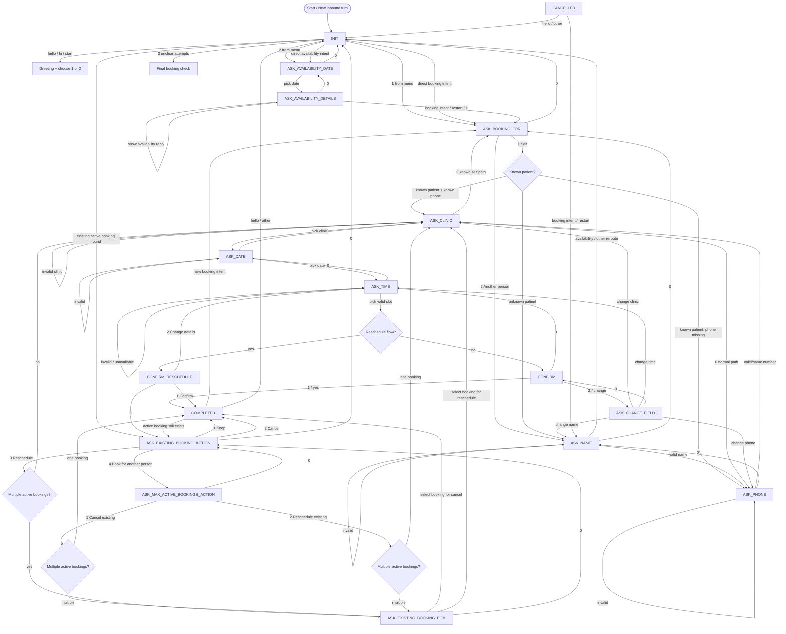

# Current Appointment FSM Flow

This is the current FSM flow based on the code in:
- [appointment_fsm.py](c:\Users\91832\Desktop\Message_bot\src\fsm\appointment_fsm.py)
- [init_availability.py](c:\Users\91832\Desktop\Message_bot\src\fsm\handlers\init_availability.py)
- [booking.py](c:\Users\91832\Desktop\Message_bot\src\fsm\handlers\booking.py)
- [existing.py](c:\Users\91832\Desktop\Message_bot\src\fsm\handlers\existing.py)

