# Conversational FSM Engine

This package implements the clinic-appointment chat bot's conversation logic as an explicit
finite-state machine (FSM). Every inbound chat message (WhatsApp or Telegram) is fed into a
single `AppointmentFSM.handle(message)` call, which inspects the FSM's current `state`,
dispatches to a small handler function for that state, mutates the FSM's fields, and returns the
text to send back to the patient. There is no framework magic here — `state` is just a string,
and the "graph" is the set of `if self.state == "..."` branches in `handle()` plus the
state-reassignments each handler performs.

Back to [root README](../../README.md).

## Important: there are two files named `appointment_fsm.py` — only one is live

- `MessageBot/src/fsm/appointment_fsm.py` (documented here) is the **real, active** FSM. This is
  what `src/fsm/__init__.py` imports and what the rest of the app (webhook routing, session
  persistence, etc.) actually uses.
- `MessageBot/src/appointment_fsm.py`, at the `src/` root (**not** inside `src/fsm/`), is a dead
  5-line re-export shim (`from src.fsm.appointment_fsm import AppointmentContext, AppointmentFSM`)
  that nothing in the codebase imports anymore. It is a leftover from before the FSM was moved
  into the `fsm/` package. Do not edit it expecting it to affect behavior, and do not confuse it
  with the file this document describes.

## Package layout

```
src/fsm/
├── __init__.py                    # re-exports AppointmentContext, AppointmentFSM, LLMClient
├── appointment_fsm.py              # AppointmentFSM dataclass, dispatch, all shared/state-agnostic helpers
├── README.md                       # this file
└── handlers/
    ├── booking.py                  # ASK_BOOKING_FOR, ASK_NAME, ASK_PHONE, ASK_CLINIC, ASK_TIME
    ├── existing.py                 # ASK_EXISTING_BOOKING_ACTION/_PICK, ASK_MAX_ACTIVE_BOOKINGS_ACTION, CONFIRM_RESCHEDULE
    └── init_availability.py        # INIT, ASK_LANGUAGE, CANCELLED, ASK_AVAILABILITY_*, CONFIRM, ASK_CHANGE_FIELD, COMPLETED, ASK_DATE
```

## 1. The `AppointmentFSM` dataclass

`AppointmentFSM` (in `appointment_fsm.py`) is a plain `@dataclass`, which makes it trivially
serializable to/from the session store (Redis, per the comments about "snapshot" restoration)
between turns of a conversation. Its fields fall into these groups:

**Collaborators / config**
- `llm_client: LLMClient` — used for the LLM-backed fallbacks (intent routing, abuse detection,
  confirm-intent detection, change-target detection, free-text extraction).
- `mixed_response_language: str = "auto"` — language mode; `"auto"` lets the bot detect/lock
  language per conversation, otherwise a fixed language can be forced.
- `enable_llm_polish: bool = True` — gates whether LLM fallbacks fire at all.
- `booking_repository: Optional[BookingRepository]` / `scheduling_repository: Optional[SchedulingRepository]`
  — DB access objects for persisting bookings and reading clinic/doctor availability.

**Conversation state**
- `state: str = "INIT"` — the current FSM state name (see section 2).
- `context: AppointmentContext` — a nested dataclass holding the patient-facing booking fields:
  `patient_name`, `appointment_mode`, `phone_number`, `appointment_date`, `appointment_time`,
  `clinic_id`, `clinic_name`, `clinic_address`, `availability_doctor`, `availability_date`,
  plus `abusive_warning_count` / `abuse_blocked` (see section 4).
- `response_language: str = "en"`, `language_locked: bool`, `language_turn_count: int`,
  `language_selected_by_user: bool` — language state; once locked, replies stay in that language
  for the rest of the session (see `_update_response_language` / `update_response_language` in
  `src/nlu/language_detector.py`).
- `init_unclear_count: int` — counts consecutive unroutable messages while in `INIT`; after 3,
  the bot gives a final nudge or bails out to `CANCELLED` (see `handle_init_state`).
- `pending_init_intent: Optional[str]` — the intent (`BOOK_APPOINTMENT` / `CHECK_AVAILABILITY` /
  `GREETING` / `OTHER`) detected before language selection, stashed so it can be resumed once the
  patient picks a language in `ASK_LANGUAGE`.

**Multi-account / multi-tenant routing**
- `doctor_id: Optional[int]`, `admin_id: Optional[int]` — which doctor/clinic-owner this
  conversation belongs to. Every DB read/write is scoped by these.
- `channel_account_id: Optional[int]`, `channel_provider: Optional[str]` — which messaging
  channel/account the conversation is bound to (WhatsApp business number vs Telegram bot, etc.).
- `chat_phone_number: Optional[str]` — the patient's raw chat identifier. For WhatsApp this is a
  phone number; for Telegram it is a scoped id parsed via
  `src.runtime.account_scope.parse_scoped_user_id`, and `_is_telegram_channel()` detects the
  `"telegram:"` prefix to branch WhatsApp-vs-Telegram behavior throughout the file (e.g. phone is
  never asked/reused the same way on Telegram, message variants differ for reschedule prompts,
  etc.).
- `bot_whatsapp_number: Optional[str]` — the clinic's outbound WhatsApp number, used in a couple
  of message templates.
- Comment in `_ensure_actor_defaults()` documents the intended contract explicitly: *"Strict
  routing mode: Do not auto-fallback to global/default doctor or admin. Caller (webhook routing
  layer) must resolve doctor/admin/channel context and inject it before FSM handling."* — i.e.
  the FSM itself never guesses which doctor/clinic it belongs to; that's resolved upstream.

**Known-patient / identity**
- `known_patient_name: Optional[str]`, `known_patient_phone: Optional[str]` — looked up from the
  DB by `_hydrate_known_patient_name()` (matched by phone number or, for Telegram, by chat user
  id) so returning patients get a personalized greeting and can skip re-typing their name/phone.

**Booking selections & caches for numeric-menu replies**

Because the bot presents numbered menus ("1. Morning Clinic\n2. Evening Clinic...") and expects
replies like `"2"`, the FSM must remember what list was last shown so it can map a digit back to
a concrete value on the next turn. These caches exist for exactly that purpose:
- `clinic_options_cache: list[dict]` — clinics currently on offer (id/name/address/ordinal).
- `date_options_cache: list[str]` — bookable dates for the currently selected clinic.
- `availability_date_options_cache: list[str]` — dates offered in the "check availability" flow
  (independent of clinic selection).
- `time_options_cache: list[str]` — raw `HH:MM` slots available for the selected clinic/date.
- `time_hour_options_cache: list[str]` — distinct hours derived from `time_options_cache`, used to
  decide whether to show an hour-window menu or period (morning/afternoon/evening) menu first.
- `time_slot_options_cache` / `time_window_labels_cache` — the currently-displayed menu of
  windows (e.g. "9:00 AM - 10:00 AM") and their underlying actual `HH:MM` value.
- `selected_time_hour`, `selected_time_period` — narrowing state while drilling from
  period -> hour -> exact slot.
- `active_booking_options_cache: list[dict]` — the patient's existing active bookings, shown as a
  numbered pick-list when they have 2+ (see `ASK_EXISTING_BOOKING_PICK`).

**Booking-for / reschedule / edit state**
- `booking_for_self: Optional[bool]` — whether this booking is for the chatting patient or "someone
  else"; drives auto-fill and the duplicate-name guard (section 6).
- `in_edit_flow: bool` — true while the patient is mid-`CONFIRM` editing a single field (e.g.
  "change clinic"); handlers check this to route back to `CONFIRM` afterward instead of continuing
  the normal forward flow.
- `existing_appointment_id`, `existing_booking_clinic_id/_name`, `existing_booking_doctor_id`,
  `existing_booking_old_date/_old_time` — the appointment being cancelled/rescheduled.
- `in_reschedule_flow: bool` — true while walking clinic->date->time again to reschedule an
  existing appointment rather than create a new one.
- `pending_existing_action: Optional[str]` — `"cancel"` or `"reschedule"`, remembered across
  `ASK_EXISTING_BOOKING_PICK` when the patient has multiple active bookings and must first pick
  which one before the action executes.

**Abuse counters**
- `context.abusive_warning_count: int`, `context.abuse_blocked: bool` — see section 4.

### `handle(message)` — the dispatch mechanism

`AppointmentFSM.handle(user_text)` is the single entrypoint. Its steps, in order:

1. Strip the input and lower-case it, then run `_normalize_option_input_for_state()`, which maps
   spoken/typed number-words (`"one"`, `"ek"`, `"एक"`, `"do"`, `"२"`, `"option 2"`, ...) to plain
   digit strings, but **only** while `self.state` is one of the menu-driven states (`ASK_LANGUAGE`,
   `ASK_BOOKING_FOR`, `ASK_EXISTING_BOOKING_ACTION`, `ASK_MAX_ACTIVE_BOOKINGS_ACTION`,
   `ASK_EXISTING_BOOKING_PICK`, `ASK_AVAILABILITY_DATE`, `ASK_CLINIC`, `ASK_DATE`, `ASK_TIME`,
   `CONFIRM_RESCHEDULE`, `CONFIRM`, `ASK_CHANGE_FIELD`). This lets patients answer menus in
   English words, Hindi/Devanagari digits, or Hinglish transliterations.
2. If `context.abuse_blocked` is already set, return `""` (silently drop the message — the
   patient has been blocked, see section 4).
3. If the message is empty after stripping, respond with the `empty_input` template.
4. Run the **fast, non-LLM** abuse check (`_is_abusive_message(..., allow_llm=False)`) against a
   fixed term list; on a hit, increment `abusive_warning_count` and either warn or block (section 4).
5. If not abusive, reset `abusive_warning_count` to 0 (abuse warnings don't accumulate across
   clean turns).
6. Check `is_end_intent(lower)` — if the patient wants to end ("stop", "cancel", "quit", "exit",
   "end"), call `_reset_all(cancelled=True)` (moves to `CANCELLED`) and reply with `ended`.
7. Check `_is_go_back(lower)` — a fixed set of go-back synonyms (`"0"`, `"back"`, `"go back"`,
   `"previous"`, `"prev"`, `"menu"`, `"c"`); if matched, `_handle_go_back()` may produce a reply
   that short-circuits the rest of dispatch (section 5).
8. Update the response language (`_update_response_language`) and opportunistically capture
   date/time prefill from the raw text via `capture_prefill_entities()` (section 7) — both run on
   **every** turn, not just the first.
9. `_ensure_actor_defaults()` and `_hydrate_known_patient_name()` run unconditionally every turn,
   because the FSM may be reconstructed fresh from a session snapshot on each webhook call, so
   these fields need to be re-derived rather than assumed to already be populated in memory.
10. Check `is_restart_intent(lower)` (`"restart"`, `"reset"`, `"start over"`, `"new appointment"`,
    `"new booking"`) — if matched, hard-resets context and jumps straight to `ASK_NAME`.
11. Finally, dispatch on `self.state` via a chain of `if self.state == "...": return handle_x(...)`
    calls. Each branch calls one imported handler function, passing `self` (as `fsm`) plus the
    raw `text` and/or lower-cased `lower` string, as needed. If `self.state` matches none of the
    known states (a corrupted/unknown state), the FSM falls through to a safety net: it resets
    everything and starts over at `ASK_NAME`.

This dispatch table is the literal definition of the state graph — see section 2 for what each
branch means.

## 2. State graph

```mermaid
stateDiagram-v2
    [*] --> INIT

    INIT --> ASK_LANGUAGE: unrouted / greeting / any first message
    ASK_LANGUAGE --> INIT: language chosen, intent was GREETING/OTHER
    ASK_LANGUAGE --> ASK_BOOKING_FOR: language chosen, intent was BOOK_APPOINTMENT
    ASK_LANGUAGE --> ASK_AVAILABILITY_DATE: language chosen, intent was CHECK_AVAILABILITY
    ASK_LANGUAGE --> ASK_EXISTING_BOOKING_ACTION: language chosen, active booking found for this patient

    INIT --> ASK_EXISTING_BOOKING_ACTION: "book" intent, exactly one active booking found
    INIT --> ASK_MAX_ACTIVE_BOOKINGS_ACTION: "book" intent, 2+ active bookings found
    INIT --> CANCELLED: 3 consecutive unclear replies and not booking intent

    CANCELLED --> ASK_LANGUAGE: any reply (re-collect intent, then continue)

    ASK_BOOKING_FOR --> ASK_NAME: "someone else" (2), or "self" (1) with no known/auto-fillable identity
    ASK_BOOKING_FOR --> ASK_CLINIC: "self" (1) and phone can be auto-filled (single clinic auto-selected -> ASK_DATE instead)
    ASK_BOOKING_FOR --> ASK_PHONE: "self" (1), known name but no phone on file
    ASK_BOOKING_FOR --> INIT: go back (0)

    ASK_NAME --> ASK_PHONE: valid name entered, booking for someone else / no phone yet
    ASK_NAME --> ASK_CLINIC: valid name entered, booking for self, chat phone auto-filled (or single clinic auto-selected -> ASK_DATE)
    ASK_NAME --> CONFIRM: valid name entered while in_edit_flow (mid-confirmation edit)
    ASK_NAME --> ASK_EXISTING_BOOKING_ACTION: Telegram, name+phone already known, active booking found
    ASK_NAME --> INIT: unrecognized name text routes to GENERAL_QUERY/OTHER/CHECK_AVAILABILITY

    ASK_PHONE --> ASK_CLINIC: valid phone captured (or single clinic auto-selected -> ASK_DATE)
    ASK_PHONE --> CONFIRM: valid phone captured while in_edit_flow
    ASK_PHONE --> ASK_EXISTING_BOOKING_ACTION: Telegram, active booking found for name+phone

    ASK_CLINIC --> ASK_DATE: clinic selected and it has bookable dates
    ASK_CLINIC --> INIT: no clinics configured for doctor

    ASK_DATE --> ASK_TIME: date selected and slots exist
    ASK_DATE --> ASK_CLINIC: no time slots for chosen date

    ASK_TIME --> CONFIRM: time selected, normal flow
    ASK_TIME --> CONFIRM_RESCHEDULE: time selected, in_reschedule_flow
    ASK_TIME --> CONFIRM: time selected while in_edit_flow (returns to confirmation)

    CONFIRM --> COMPLETED: confirmed yes (booking persisted)
    CONFIRM --> ASK_CHANGE_FIELD: "no"/"change" with no specific field detected
    CONFIRM --> ASK_NAME: "change name" detected directly
    CONFIRM --> ASK_PHONE: "change phone" detected directly
    CONFIRM --> ASK_CLINIC: "change clinic" detected directly
    CONFIRM --> ASK_DATE: "change date" detected directly
    CONFIRM --> ASK_TIME: "change time" detected directly
    CONFIRM --> [prior state]: go back (0)

    ASK_CHANGE_FIELD --> ASK_NAME: field = name (1)
    ASK_CHANGE_FIELD --> ASK_PHONE: field = phone (2)
    ASK_CHANGE_FIELD --> ASK_CLINIC: field = clinic (3)
    ASK_CHANGE_FIELD --> ASK_DATE: field = date (4)
    ASK_CHANGE_FIELD --> ASK_TIME: field = time (5)
    ASK_CHANGE_FIELD --> CONFIRM: go back (0)

    ASK_EXISTING_BOOKING_ACTION --> COMPLETED: keep existing (1)
    ASK_EXISTING_BOOKING_ACTION --> COMPLETED: cancel only (2), single booking
    ASK_EXISTING_BOOKING_ACTION --> ASK_EXISTING_BOOKING_PICK: cancel/reschedule (2/3), 2+ bookings
    ASK_EXISTING_BOOKING_ACTION --> ASK_CLINIC: cancel & rebook / reschedule (3), single booking (in_reschedule_flow=true)
    ASK_EXISTING_BOOKING_ACTION --> ASK_NAME: book for another person (4)
    ASK_EXISTING_BOOKING_ACTION --> INIT: show all (5) with no rows, or go back (0)

    ASK_MAX_ACTIVE_BOOKINGS_ACTION --> COMPLETED: cancel (1), single booking resolved
    ASK_MAX_ACTIVE_BOOKINGS_ACTION --> ASK_EXISTING_BOOKING_PICK: cancel/reschedule (1/2), 2+ bookings
    ASK_MAX_ACTIVE_BOOKINGS_ACTION --> ASK_CLINIC: reschedule (2), single booking resolved
    ASK_MAX_ACTIVE_BOOKINGS_ACTION --> ASK_EXISTING_BOOKING_ACTION: go back (0)

    ASK_EXISTING_BOOKING_PICK --> COMPLETED: picked booking, pending action = cancel
    ASK_EXISTING_BOOKING_PICK --> ASK_CLINIC: picked booking, pending action = reschedule
    ASK_EXISTING_BOOKING_PICK --> ASK_EXISTING_BOOKING_ACTION: go back (0)

    CONFIRM_RESCHEDULE --> COMPLETED: confirmed yes, reschedule persisted (or failed)
    CONFIRM_RESCHEDULE --> ASK_TIME: "change time" (2), non-Telegram
    CONFIRM_RESCHEDULE --> ASK_EXISTING_BOOKING_ACTION: no / (0)

    ASK_AVAILABILITY_DATE --> ASK_AVAILABILITY_DETAILS: date picked, shows availability
    ASK_AVAILABILITY_DATE --> INIT: go back (0)

    ASK_AVAILABILITY_DETAILS --> ASK_BOOKING_FOR: booking intent detected mid-availability-chat
    ASK_AVAILABILITY_DETAILS --> ASK_AVAILABILITY_DETAILS: more doctor/date free text parsed, stays to show more results
    ASK_AVAILABILITY_DETAILS --> ASK_AVAILABILITY_DATE: go back (0)

    COMPLETED --> ASK_LANGUAGE: any next reply (re-collect intent, then continue)
    COMPLETED --> [*]

    CANCELLED --> [*]
```



Notes on reading this diagram: most states appear to "loop back to themselves" implicitly on
invalid input (e.g. an unrecognized digit at `ASK_CLINIC` just re-prompts `ASK_CLINIC`) — those
self-loops are omitted from the diagram for readability; only edges that actually change `state`
are drawn. `[prior state]` on the `CONFIRM` go-back edge means "whatever state was previously
active" (see `_handle_go_back`, section 5) — from `CONFIRM` that is always `ASK_TIME`.

### State-by-state reference

| State | Expects | What determines the next state |
|---|---|---|
| `INIT` | Free text, or `1`/`2`/`0` menu digits, or Telegram `/start` | `route_initial_decision()` (LLM/rule hybrid) classifies into `BOOK_APPOINTMENT`, `CHECK_AVAILABILITY`, `GREETING`, `GENERAL_QUERY`/`OTHER`, or `ABUSE`. Language is always collected first via `ASK_LANGUAGE` unless already selected this session (`language_selected_by_user`). After 3 unclear turns, routes to `CANCELLED`. |
| `ASK_LANGUAGE` | `1`/`english`/`en`, `2`/`hindi`/`hi`/हिंदी, `3`/`hinglish` | Sets `response_language` + `language_locked`, then resumes whatever intent was pending in `pending_init_intent` (book / check availability / greeting / other). |
| `ASK_BOOKING_FOR` | `1`/`self`/`myself`/`a`, `2`/`another`/`other`/`b`, or `0` | Sets `booking_for_self`. Self bookings with a known patient record try to auto-fill name+phone and may skip straight to `ASK_CLINIC` (or even `ASK_DATE` if there is exactly one clinic). |
| `ASK_NAME` | Free text name | `extract_name()` parses it. Failure re-routes through `route_initial_decision` (patient may have typed something else entirely). Success moves to `ASK_PHONE`, `ASK_CLINIC` (self + auto-fillable phone), or back to `CONFIRM` if `in_edit_flow`. |
| `ASK_PHONE` | 10-digit phone, or "same number"/"different number" replies | `extract_phone()` / same-number heuristics. On Telegram, phone reuse is disabled entirely. Moves to `ASK_CLINIC` (or auto-selected `ASK_DATE`), or back to `CONFIRM` if editing. |
| `ASK_CLINIC` | Digit index or clinic-name text | `_select_clinic()` matches against `clinic_options_cache` fetched from `scheduling_repository`. Valid pick clears date/time caches and moves to `ASK_DATE` (or back to `ASK_CLINIC` if that clinic has no dates). |
| `ASK_DATE` | Digit index, or `"today"`/`"tomorrow"` | Matched against `date_options_cache`/live `_date_options()`. Valid date loads time slots and moves to `ASK_TIME` (or stays at `ASK_DATE` if no slots that day). |
| `ASK_TIME` | Digit index into hour-window or slot menu, free text time, or a period name (morning/afternoon/evening) | `extract_time()` / LLM fallback, or period->hour->slot menu drill-down (`_initial_time_prompt`, `_time_period_prompt`, `_time_slot_prompt`). Valid pick moves to `CONFIRM`, `CONFIRM_RESCHEDULE` (if `in_reschedule_flow`), or back to `CONFIRM` (if `in_edit_flow`). |
| `CONFIRM` | `1`/yes, `2`/`0`/no, "change X", or free text | `_detect_confirm_intent()` (rule-based, LLM fallback). Yes persists the booking (`_persist_confirmed_appointment`) and moves to `COMPLETED`. No/change tries `resolve_change_target()`/`llm_change_target()` to jump directly to the named field's state, else falls to `ASK_CHANGE_FIELD`. |
| `COMPLETED` | Any reply | Preserves the locked language, resets everything else via `_reset_all(cancelled=False)`, and re-routes the reply as a fresh intent (book again / check availability / greeting / other), landing back in `ASK_LANGUAGE` (or directly forward if language was already selected this session). |
| `CANCELLED` | Any reply | `_reset_all(cancelled=False)` then classifies the reply into a `pending_init_intent` and always moves to `ASK_LANGUAGE`. |
| `ASK_EXISTING_BOOKING_ACTION` | `1`-`5` or synonyms | `1` keep / `2` cancel / `3` reschedule / `4` book for another person / `5` list all / `0` back. Multi-booking patients (`_active_booking_rows_for_chat_phone` returns 2+) get routed to `ASK_EXISTING_BOOKING_PICK` first. |
| `ASK_EXISTING_BOOKING_PICK` | Digit index into `active_booking_options_cache` | Resolves which of several active bookings the patient meant, then executes `pending_existing_action` (`"cancel"` -> `COMPLETED`, `"reschedule"` -> `ASK_CLINIC`). |
| `ASK_MAX_ACTIVE_BOOKINGS_ACTION` | `1`/`2`/`0` | Shown instead of the normal booking flow when the patient already has 2 active bookings (the cap — see section 6). `1` cancel, `2` reschedule, `0` back to `ASK_EXISTING_BOOKING_ACTION`. |
| `ASK_AVAILABILITY_DATE` | Digit index into upcoming dates, or `0` | Looks up doctor-wide availability (no clinic chosen yet) and moves to `ASK_AVAILABILITY_DETAILS`. |
| `ASK_AVAILABILITY_DETAILS` | Free text (doctor name / date), digit re-pick, or booking intent | Can re-run `_availability_reply()` for a newly mentioned date/doctor while staying in state, or detect a booking intent and jump to `ASK_BOOKING_FOR`. |
| `CONFIRM_RESCHEDULE` | `1`/yes, `2` (change time), `0`/no | Yes calls `reschedule_appointment_same_clinic()` and moves to `COMPLETED`; change-time (non-Telegram) goes to `ASK_TIME`; no/`0` returns to `ASK_EXISTING_BOOKING_ACTION`. |
| `ASK_CHANGE_FIELD` | `1`-`5`, free text field name, or `0` | `resolve_change_target()` / `_change_state_from_option()` / LLM fallback maps the reply to `ASK_NAME`/`ASK_PHONE`/`ASK_CLINIC`/`ASK_DATE`/`ASK_TIME` and sets `in_edit_flow = True` before jumping there. |

## 3. Handler modules — who owns which states

`appointment_fsm.py` imports handler functions from three sibling modules under `handlers/` and
dispatches to them purely by state name (see the `handle()` listing in section 1). None of the
state logic lives inline in `appointment_fsm.py` itself — that file only holds the dataclass,
the dispatch table, and shared helper methods (menu prompt builders, DB lookups, language/abuse
helpers, etc.) that multiple handlers call back into via `fsm.<method>()`.

| Handler module | States it owns | Functions |
|---|---|---|
| `handlers/booking.py` | `ASK_BOOKING_FOR`, `ASK_NAME`, `ASK_PHONE`, `ASK_CLINIC`, `ASK_TIME` | `handle_ask_booking_for_state`, `handle_ask_name_state`, `handle_ask_phone_state`, `handle_ask_clinic_state`, `handle_ask_time_state` |
| `handlers/existing.py` | `ASK_EXISTING_BOOKING_ACTION`, `ASK_EXISTING_BOOKING_PICK`, `ASK_MAX_ACTIVE_BOOKINGS_ACTION`, `CONFIRM_RESCHEDULE` | `handle_existing_booking_action_state`, `handle_max_active_bookings_action_state`, `handle_existing_booking_pick_state`, `handle_confirm_reschedule_state` |
| `handlers/init_availability.py` | `INIT`, `ASK_LANGUAGE` (both via `handle_init_state`), `CANCELLED`, `ASK_AVAILABILITY_DATE`, `ASK_AVAILABILITY_DETAILS`, `CONFIRM`, `ASK_CHANGE_FIELD`, `COMPLETED`, `ASK_DATE` | `handle_init_state`, `handle_cancelled_state`, `handle_availability_date_state`, `handle_availability_details_state`, `handle_confirm_state`, `handle_change_field_state`, `handle_completed_state`, `handle_ask_date_state` |

Why split into three files instead of one ~2500-line handler module: each file groups states that
are conceptually one sub-flow — "collecting a new booking's identity/clinic/time" (`booking.py`),
"managing a patient's already-existing appointment" (`existing.py`), and "session bootstrapping,
language selection, availability lookup, and confirmation/edit/completion" (`init_availability.py`).
Keeping them separate makes each file reviewable on its own, keeps diffs small when only one
sub-flow changes, and avoids one dataclass-plus-1500-line-dispatcher file growing even further —
`appointment_fsm.py` is already ~1500 lines by itself.

**Local-import-inside-function pattern.** Every handler function signature takes `fsm:
"AppointmentFSM"` typed only under `TYPE_CHECKING`:

```python
from typing import TYPE_CHECKING
if TYPE_CHECKING:
    from src.fsm.appointment_fsm import AppointmentFSM
```

This is necessary because `appointment_fsm.py` imports the handler functions at module load time
(`from src.fsm.handlers.booking import handle_ask_booking_for_state, ...`), so if `booking.py`
also imported `AppointmentFSM` from `appointment_fsm.py` at module level, the two modules would
import each other and Python would hit a circular-import error during startup. Guarding the type
import behind `TYPE_CHECKING` means it only exists for static type checkers (mypy/pyright/IDE),
never at runtime — at runtime the handler functions just receive an untyped `fsm` object and call
whatever methods/attributes they need on it (duck typing), so no runtime import of
`AppointmentFSM` is ever needed inside `handlers/`.

## 4. Abuse detection

Abuse detection runs in two layers:

- **Fast, deterministic term-list check** — `_is_abusive_message(text, lower, allow_llm=False)`
  in `appointment_fsm.py`, run unconditionally at the very top of `handle()` on every message
  regardless of state. It checks three term sets:
  - `ABUSE_TERMS_EN` — English profanity (`fuck`, `shit`, `bitch`, `asshole`, `bastard`, `idiot`).
  - `ABUSE_TERMS_HINGLISH` — Latin-script Hindi/Hinglish profanity (`madarchod`, `bhenchod`,
    `chutiya`, `harami`, `gandu`, `bakchod`).
  - `ABUSE_TERMS_HI` — Devanagari-script equivalents (मादरचोद, बहनचोद, चूतिया, हरामी, गांडू,
    भोसड़ी).

  English/Hinglish terms are matched as whole words against a normalized, space-padded,
  non-alphanumeric-stripped copy of the lower-cased text (`" fuck "` style substring match so
  "fucker" doesn't false-positive-free words, but exact tokens do match). Devanagari terms are
  matched as plain substrings of the original (non-normalized) text since Devanagari has no ASCII
  word-boundary regex issues here.

- **LLM-backed check** — `llm_detect_abuse()` (from `src.llm.tasks`), only invoked with
  `allow_llm=True` from inside `route_initial_decision()` in the `INIT` state path (via
  `handlers/init_availability.py`), as a secondary, smarter classifier for abusive intent that
  doesn't use a listed slur (sarcasm, indirect insults, etc.). `INIT` also has an early-out,
  `_is_init_safe_input()`, that skips the LLM check entirely for obviously-safe inputs (bare menu
  digits `0`/`1`/`2`, or one/two-word greetings) to save latency/cost.

**Escalation.** Both layers feed the same counter, `context.abusive_warning_count`:
- 1st abusive message: counter goes to 1, bot replies with the `abusive_language` template (a
  warning), and processing stops for that turn.
- 2nd abusive message (counter reaches 2): `context.abuse_blocked = True` is set, the bot sends
  the `abusive_language_final` template, and the conversation is effectively over.
- Any clean (non-abusive) message resets the counter back to 0 — warnings don't accumulate
  indefinitely, only consecutively.
- Once `context.abuse_blocked` is `True`, `handle()` returns `""` for every subsequent message —
  the bot goes silent rather than continuing to respond. Because `_reset_all()` creates a brand
  new `AppointmentContext()`, exiting the abuse-blocked state requires a fresh session/context
  (e.g. a new conversation), not just further chatting.

## 5. Go-back / navigation

Two related mechanisms let patients navigate backwards or answer menus flexibly:

**Numeric shortcuts and go-back trigger.** `_is_go_back(lower_text)` is a static method matching
a fixed synonym set: `"go back"`, `"back"`, `"previous"`, `"prev"`, `"menu"`, `"0"`, `"c"`. This
check runs early in `handle()`, before state dispatch, so "go back" works uniformly from any
state. When matched, `_handle_go_back()` is called, which is a big `if self.state == "...":`
ladder mapping each state to the state that should come before it (see the table below); it
mutates `self.state` and returns the appropriate re-prompt text, which `handle()` returns
immediately (short-circuiting normal dispatch for that turn). If `_handle_go_back()` returns
`None` for the current state (no back-target defined), execution falls through to normal dispatch
instead — the literal input is passed along to the state handler.

| From state | Goes back to |
|---|---|
| `ASK_BOOKING_FOR` | `INIT` (main menu) |
| `ASK_NAME` | `ASK_BOOKING_FOR` |
| `ASK_LANGUAGE` | re-shows the language prompt (stays in `ASK_LANGUAGE`) |
| `ASK_PHONE` | `ASK_NAME` |
| `ASK_CLINIC` | `ASK_BOOKING_FOR` if it was a known-patient self-booking that skipped the phone step, else `ASK_PHONE` |
| `ASK_DATE` | `ASK_CLINIC` |
| `ASK_TIME` | `ASK_DATE` |
| `ASK_AVAILABILITY_DATE` | `INIT` |
| `ASK_AVAILABILITY_DETAILS` | `ASK_AVAILABILITY_DATE` |
| `ASK_CHANGE_FIELD` | `CONFIRM` |
| `CONFIRM` | `ASK_TIME` (reloading `time_options_cache` from the DB first if the in-memory cache is empty, which can happen after restoring from an older session snapshot) |

**`_normalize_option_input_for_state()`.** Separately from the go-back synonym check, this method
(called once at the very top of `handle()`, before anything else) rewrites the raw input into a
canonical digit **only** while the current state is one of the menu-driven states listed in
section 1, step 1. It recognizes English number words (`"one"`..`"five"`), homophone/typo variants
(`"won"`, `"too"`/`"to"`, `"tree"`, `"for"`), Hinglish transliterations (`"ek"`, `"do"`, `"teen"`,
`"char"`, `"paanch"`), Devanagari words and digits (`"एक"`, `"दो"`, `"३"`, ...), and
`"option N"`/`"number N"`/`"choice N"`/`"no. N"` prefixed phrasing — mapping all of these to plain
`"0"`-`"5"` before the rest of `handle()` and any state handler ever sees the text. This is what
lets a patient answer a numbered menu with "do" or "option 2" and have it work exactly like typing
`"2"`.

## 6. Known-patient auto-fill, self-vs-other booking, active-booking cap, reschedule, and mid-confirmation edit

**Known-patient auto-fill.** `_hydrate_known_patient_name()` runs unconditionally on every turn
(section 1, step 9) and, if `known_patient_name` isn't already set, looks the patient up in
`booking_repository` — by chat user id on Telegram (`find_patient_name_by_chat_user_id` /
`find_patient_phone_by_chat_user_id`), or by normalized phone number on WhatsApp
(`find_patient_name_by_phone_number`). If found, `_welcome_known_patient*` templates greet them by
name, and `handle_ask_booking_for_state` (`handlers/booking.py`) will pre-fill
`context.patient_name` from `known_patient_name` and `context.phone_number` from the chat's own
number (WhatsApp) or `known_patient_phone` (Telegram) when the patient chooses "booking for
myself" — skipping straight past `ASK_NAME`/`ASK_PHONE` to `ASK_CLINIC` (and even past `ASK_CLINIC`
to `ASK_DATE` if `_auto_select_single_clinic_after_phone()` finds the doctor has only one clinic).

**Self vs. someone else.** `booking_for_self` is set explicitly by the patient's answer at
`ASK_BOOKING_FOR` (`1`/self vs `2`/other). When booking for someone else, `handle_ask_name_state`
enforces a guard: the entered name may not match `known_patient_name` (the chatting patient's own
name) — `other_person_name_must_differ` is returned if it does, preventing a patient from
"booking for someone else" using their own identity.

**Active-booking cap of 2.** Before starting a fresh booking, `_existing_booking_entry_response()`
/ `_existing_booking_response_for_context_identity()` query
`list_active_appointments_by_phone_number` / `list_active_appointments_by_chat_user_id` (up to a
DB-side `limit=10`, but the *behavioral* cap enforced by the FSM is 2):
- 0 active bookings -> proceed with the normal new-booking flow.
- Exactly 1 active booking -> `ASK_EXISTING_BOOKING_ACTION` (keep / cancel / reschedule / book for
  someone else / list all).
- 2 or more active bookings -> `ASK_MAX_ACTIVE_BOOKINGS_ACTION`, a more restrictive menu (only
  cancel or reschedule an existing one — no "keep" option and no starting a third booking),
  because the DB layer itself also blocks a third concurrent booking
  (`OTHER_ACTIVE_BOOKING_BLOCK_MESSAGE`, surfaced as `other_active_booking_exists` if the save
  ever races past this check). When there are 2+ matches, the specific booking to act on is
  resolved via `ASK_EXISTING_BOOKING_PICK`, a numbered list built from
  `active_booking_options_cache`.

**Reschedule flow.** Triggered from `ASK_EXISTING_BOOKING_ACTION` (option 3), the single-booking
branch of `ASK_MAX_ACTIVE_BOOKINGS_ACTION` (option 2), or after a pick in
`ASK_EXISTING_BOOKING_PICK`. It sets `in_reschedule_flow = True`, clears `context.clinic_id`,
`clinic_name`, `clinic_address`, `appointment_date`, `appointment_time` and all the date/time
caches, and routes to `ASK_CLINIC` to walk clinic -> date -> time again from scratch. When
`ASK_TIME` is reached with `in_reschedule_flow` true, instead of going to plain `CONFIRM` it goes
to `CONFIRM_RESCHEDULE`, which on "yes" calls
`_resolve_current_reschedule_time()` (re-validates the chosen hour is still free, including a
Telegram-specific double-booking check via `_telegram_reschedule_conflict_exists()`) and then
`booking_repository.reschedule_appointment_same_clinic()` before moving to `COMPLETED`.

**Mid-confirmation "change X" edit flow.** From `CONFIRM`, replying "no"/"change"/anything that
isn't a yes routes through `_detect_confirm_intent()`. If the free text already names a field
(e.g. "change my phone number"), `resolve_change_target(lower)` (in `src/nlu/extractors.py`) maps
keywords (`"time"`, `"date"`/`"day"`, `"clinic"`/`"branch"`/`"location"`, `"phone"`/`"number"`/
`"contact"`, `"name"`) directly to the target state and the FSM jumps there immediately. If no
field is named, the LLM fallback `llm_change_target()` gets a chance, and if that also can't
resolve it, the FSM falls back to the explicit numbered menu, `ASK_CHANGE_FIELD` (1=name, 2=phone,
3=clinic, 4=date, 5=time, mapped by `_change_state_from_option()`). Either path sets
`in_edit_flow = True` before leaving `CONFIRM`. Each of the five target-state handlers
(`handle_ask_name_state`, `handle_ask_phone_state`, `handle_ask_clinic_state`,
`handle_ask_date_state`/`handle_ask_time_state`) checks `fsm.in_edit_flow` once it successfully
captures the new value, and if true, clears the flag and jumps straight back to `CONFIRM` (showing
the updated `confirm_summary`) instead of continuing forward through the rest of the normal
booking sequence — e.g. changing just the clinic doesn't force the patient to also re-pick date
and time unless the new clinic invalidates the previously-chosen ones.

## 7. Prefill from the first message

Two things capture information the patient volunteers before the FSM formally asks for it:

- `capture_prefill_entities(self.context, text)` (from `src.nlu.extractors`) is called
  unconditionally on every turn near the top of `handle()` (section 1, step 8) — not only the
  first message, but every message, including the very first one before any state-specific prompt
  has been shown. It opportunistically fills `context.appointment_date` / `context.appointment_time`
  using the same rule-based `extract_date()` / `extract_time()` parsers the later state handlers
  use, but only if those fields aren't already set. This means if a patient's very first message
  to the bot is something like "I need an appointment tomorrow at 5pm", `appointment_date` and
  `appointment_time` are already populated in `context` by the time the conversation reaches
  `ASK_DATE`/`ASK_TIME` — though note the current `ASK_DATE`/`ASK_TIME` handlers still re-prompt
  with the numbered menu rather than silently auto-confirming the prefilled value; the prefill
  mainly saves the *extraction* step, and `handle_ask_time_state` in particular reuses
  `context.appointment_date`/`appointment_time` values when checking whether a freshly typed date
  changes what's shown.

- `AppointmentFSM` also defines `_detect_booking_actor_from_text()`,
  `_apply_init_booking_prefill_from_llm()`, `_apply_init_booking_prefill_from_rules()`, and
  `_route_after_init_prefill()` — a more ambitious prefill pipeline that would extract patient
  name / clinic / date / time / booking-for-self-or-other from a single free-text message (via
  both `llm_extract_booking_prefill()` and rule-based extractors) and then fast-forward the state
  machine past every field it could fill, straight to `CONFIRM` if everything was present. As of
  this reading of the code, **none of these four methods are called anywhere else in the
  codebase** — they are defined but not wired into `handle()` or any handler's dispatch path.
  Treat them as either legacy or work-in-progress; the prefill behavior that is actually live
  today is limited to date/time via `capture_prefill_entities()` described above.

## 8. NLU and LLM integration

The FSM leans on two sibling packages rather than doing text understanding itself:

- **`src/nlu`** — deterministic, rule-based helpers: `extract_name`, `extract_phone`,
  `extract_date`, `extract_time`, `extract_doctor_name`, `is_yes`, `is_no`, `is_end_intent`,
  `is_restart_intent`, `is_greeting_intent`, `is_booking_intent`, `resolve_change_target`,
  `capture_prefill_entities` (all in `src/nlu/extractors.py`), plus `route_initial_decision()`
  (`src/nlu/initial_router.py`, classifies free text in `INIT` into `BOOK_APPOINTMENT` /
  `CHECK_AVAILABILITY` / `GREETING` / `GENERAL_QUERY` / `OTHER` / `ABUSE`, with language
  detection bundled in) and `update_response_language()` (`src/nlu/language_detector.py`).
  These are tried first, everywhere, because they're fast and free.
- **`src/llm`** — used only as a fallback when the rule-based layer can't confidently decide:
  `llm_extract` (generic date/time field extraction), `llm_extract_booking_prefill`,
  `llm_detect_abuse`, `llm_detect_confirm_intent`, `llm_change_target` (all in
  `src/llm/tasks.py`), invoked through the shared `LLMClient` (`src/llm/client.py`) that every
  `AppointmentFSM` instance holds as `self.llm_client`. Every LLM call site is gated by
  `self.enable_llm_polish`, so LLM fallbacks can be disabled wholesale (e.g. for tests or
  cost-sensitive deployments) while the rule-based layer keeps working.

See `../nlu/README.md` for the deeper design of the NLU layer (this document intentionally does
not duplicate it).

Back to [root README](../../README.md).
